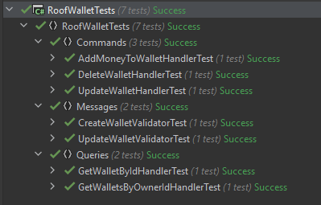

### Neyi neden kullandım?
* **.NET Core 5.0 kullandım.**
* **Onion mimarısi kullandım.** Günümüzde bir çok proje microservice mimarisiyle yazılmata. Uygulama da bu mimariye uygun uygulamam mimarisi olarak doğru bir mimarı olduğunu düşündüm.
* **MediatR kullandım.** Yaygin olarak yine C# .NET Core ile geliştirilen REST Api'ler kullanılan pipeline için güzel ve kullanışlı bir framework olduğunu düşünyorum.
* **EntityiFrameworkCore kullandım.** RDBMS veri tabanları için en yaygın ORM framework olduğundan tercih ediyorum. Domain'i düşünürken database bağımlı düşünmedim. Her hangi bir NoSQL databasede olabilir.
* **XUnit kullandım.** Unit testler için XUnit kullandım.
* **Swagger kullandım.** REST Api dökümantasyon için kullandım. Not: .NETE Core 5.0'da yeni bir Web Api oluşturulurken default olarak geliyor.
* **Commants ve Queries** olarak handlerları ayrı tuttum. Bunun sebebi hem bu zamana kadar böyle gördüm hemde CRUD işlemlerde database doğrudan yazan işlemlerin ayrı tutulması daha güvenilir ve yönetilebilir. [Bkz](https://henriquesd.medium.com/the-command-and-query-responsibility-segregation-cqrs-pattern-16cb7704c809#:~:text=The%20Command%20and%20Query%20Responsibility%20Segregation%20(CQRS)%20it's%20an%20architectural,are%20responsible%20for%20update%20data)

### Unit Tests

# Packages
### RoofWallet.Domain
`dotnet add package Microsoft.EntityFrameworkCore --version 5.0.0`

`dotnet add package Microsoft.EntityFrameworkCore.Relational --version 5.0.0`

### RoofWalletApi
`dotnet add package Microsoft.EntityFrameworkCore.Design --version 5.0.0`

`dotnet add package Microsoft.EntityFrameworkCore.InMemory --version 5.0.0`

`dotnet add package Swashbuckle.AspNetCore --version 5.6.3`

### Links and References
[XUnit – Part 5: Share Test Context With IClassFixture and ICollectionFixture](https://hamidmosalla.com/2020/02/02/xunit-part-5-share-test-context-with-iclassfixture-and-icollectionfixture/)
[https://xunit.net/docs/shared-context#collection-fixture](https://xunit.net/docs/shared-context#collection-fixture)
[ASP.NET Core 'de birim test denetleyicisi mantığı](https://docs.microsoft.com/tr-tr/aspnet/core/mvc/controllers/testing?view=aspnetcore-5.0)
